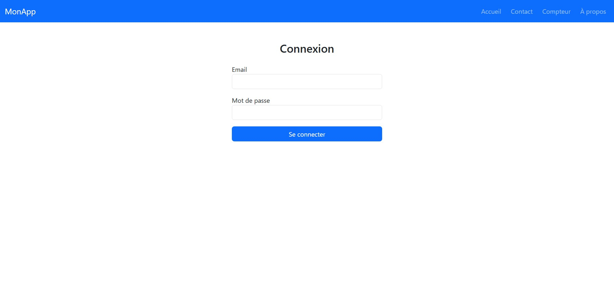
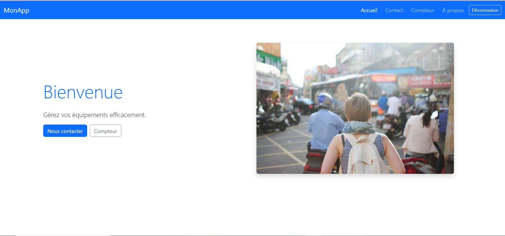
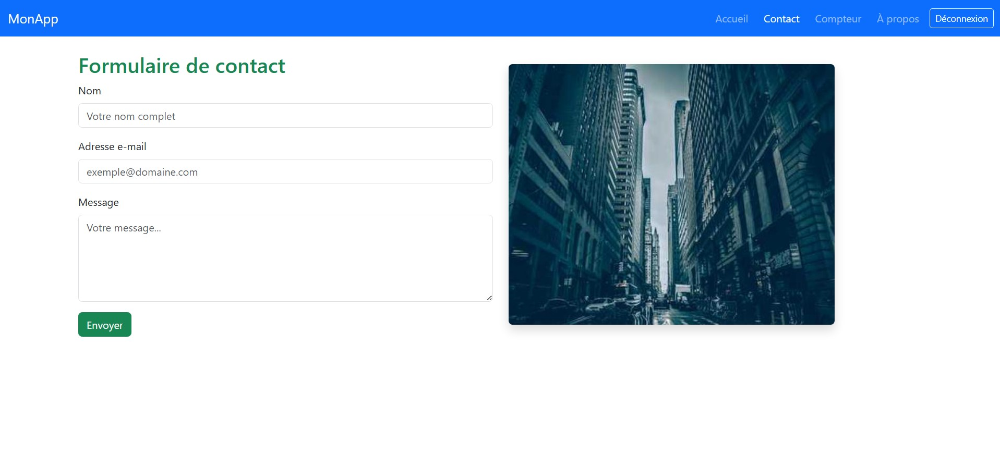
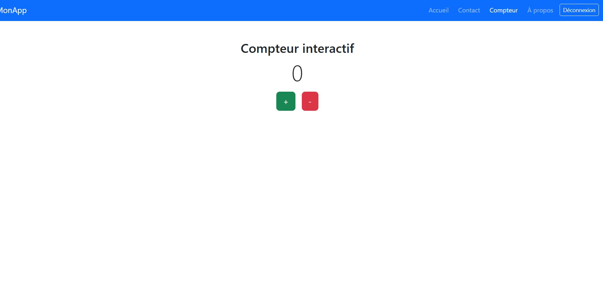
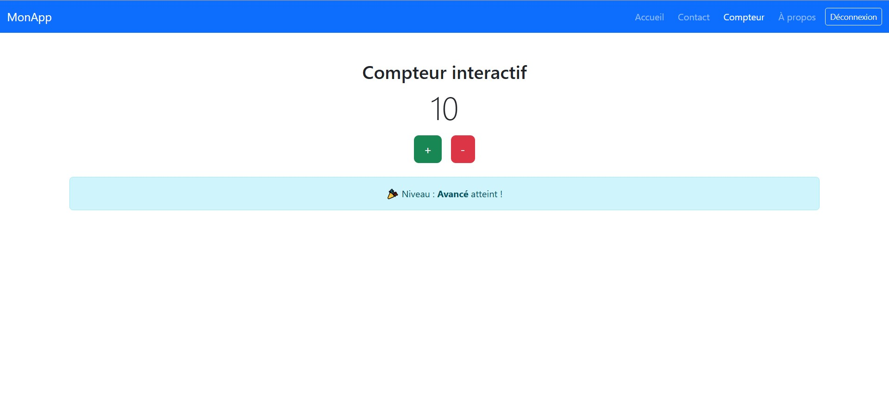
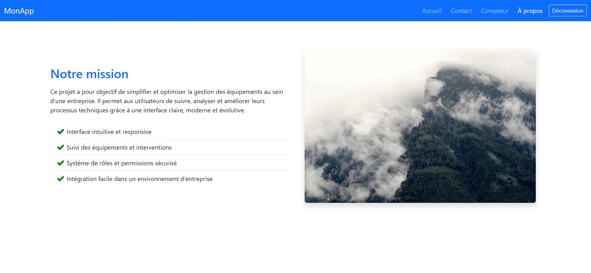

# 🔐 MonApp - Plateforme de gestion d’équipements

Bienvenue sur **MonApp**, une application Angular moderne et sécurisée permettant la gestion efficace des équipements.  
Elle propose une interface intuitive, un système d’authentification et une navigation responsive.

---

## 🚀 Fonctionnalités

- ✅ Authentification avec email et mot de passe
- 🔐 Protection des routes via AuthGuard
- 🧭 Navigation entre plusieurs pages (Accueil, Contact, Compteur, À propos)
- 💡 Persistance de session avec `localStorage`
- 📦 Architecture en composants standalone (Angular moderne)
- 🎯 Compteur interactif avec seuils visuels

---

## 📸 Aperçu

### 🔑 Page de connexion


### 🏠 Accueil


### 📞 Page de contact


### ➕ Compteur interactif


### 🔟 Niveau avancé atteint


### ℹ️ À propos


---

## 🛠️ Technologies utilisées

- Angular 17+ (standalone components)
- TypeScript
- Bootstrap 5
- LocalStorage
- Angular Router / AuthGuard

---

## 🧪 Accès de test

> Email : `admin@ocpgroup.ma`  
> Mot de passe : `password`

---

## 📁 Structure du projet

```bash
src/
├── app/
│   ├── pages/
│   │   ├── login/       # Page de connexion
│   │   ├── accueil/
│   │   ├── contact/
│   │   ├── compteur/
│   │   └── apropos/
│   ├── services/        # AuthService
│   ├── guards/          # AuthGuard
│   ├── app.routes.ts
│   ├── app.component.*
│   └── app.config.ts
